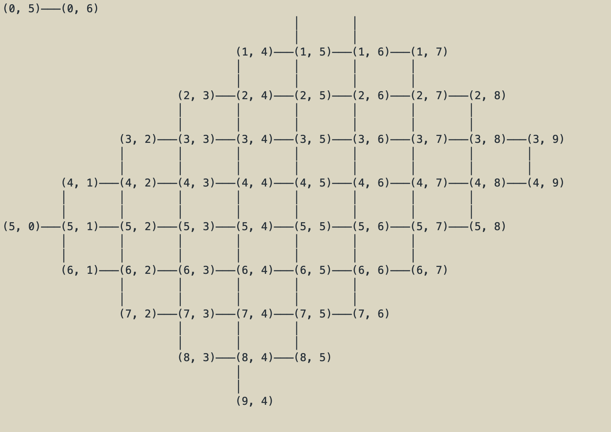
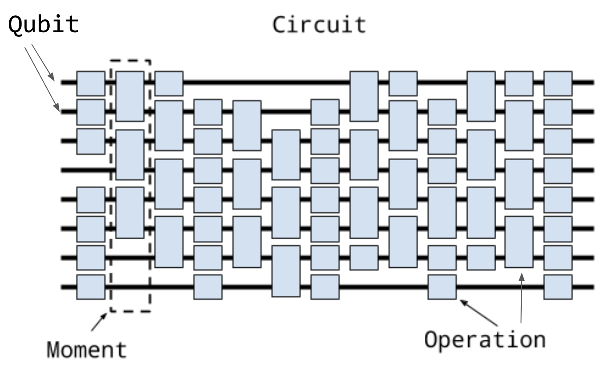

#  入门 - Cirq介绍


>声明：This guide is based on the official Cirq documentation created by Google, which is available at [Google Quantum AI - Introduction to Cirq](https://quantumai.google/cirq/start/intro). The original content is licensed under the Creative Commons Attribution 4.0 License for documentation and the [Apache 2.0 License](https://www.apache.org/licenses/LICENSE-2.0) for code samples. This translation aims to make Cirq more accessible to the Chinese-speaking community by adapting the original material for clarity and relevance to this audience. While I have made modifications to enhance understanding, I have preserved the technical intent and accuracy of the original documentation. All trademarks, such as Cirq, remain the property of their respective owners, and this work does not imply any endorsement by Google.

Cirq是一个开源的量子计算机编程框架。

Cirq是一个Python软件库，用于编写、操作和优化量子电路，然后在量子计算机和量子模拟器上运行它们。Cirq提供了有用的抽象处理，用于处理当今的噪声中等规模量子计算机，在这些计算机上，硬件的细节对于实现最先进的结果至关重要。

Cirq是一个用于为噪声中等规模量子（NISQ）设备编写量子算法的框架。大致来说，NISQ设备是那些具有 $O(100)$ 量子比特并且可以执行 $O(1000)$ 门操作的设备。由于NISQ设备的资源非常有限，我们认为用于在这些设备上编写程序的框架需要了解算法所编写设备的所有架构属性。这与其他框架形成对比，在其他框架中，使用的抽象模型与设备的细节之间有一个清晰的分离。

在《入门》系列文章中，我们将逐步讲解在Cirq中编写量子算法的基础知识。我们的最终目标是编写一个用于优化算法的变分参数化电路。

安装Cirq
要使用Cirq，首先需要安装Cirq。安装说明可以在 [install](https://quantumai.google/cirq/start/install) 找到。为了本教程的目的，我们运行 `pip install cirq` 来安装最新版本的Cirq，如下代码单元所示。


```python
# 安装Cirq
try:
    import cirq
except ImportError:
    print("installing cirq...")
    !pip install --quiet cirq
    print("installed cirq.")
    import cirq

import matplotlib.pyplot as plt
import numpy as np
````

让我们通过导入Cirq并打印出Google的Sycamore设备的图示来检查Cirq是否已成功安装。

```python
# 导入Cirq
import cirq

# 打印Google的Sycamore设备的图示
sycamore = cirq.google.Sycamore
print(sycamore)
````



## 量子比特、操作、时刻和电路
在Cirq中，电路由一个Circuit对象表示。概念上：

- 一个**Circuit**是多个**Moments**的集合。
- 一个**Moment**是同时作用于同一时刻的多个**Operations**的集合。（同一竖线）
- 一个**Operation**是作用于特定子集量子比特的效果。（同一横线）
- 最常见的**Operation**类型是应用于多个量子比特的**Gate**，量子门（称为"GateOperation"）。
- 电路的量子比特由操作隐式定义——你不能将量子比特分配给一个Circuit。


*图1：Cirq电路的概念图示, 引用自：https://quantumai.google/cirq/start/intro*

这些概念通过上面的图示进行了说明，其中时间从左到右，水平线表示不同的量子比特，作用于量子比特的操作是方框（有时跨越多个量子比特），而一个时刻是一组“同时发生”的操作。

创建一个电路
下面展示了创建一个电路的典型方法。

```python
"""创建一个电路。"""
# 定义三个量子比特。
a = cirq.NamedQubit("a")
b = cirq.NamedQubit("b")
c = cirq.NamedQubit("c")

# 定义一系列操作。
ops = [cirq.H(a), cirq.H(b), cirq.CNOT(b, c), cirq.H(b)]

# 从操作列表中创建一个电路。
circuit = cirq.Circuit(ops)
print("电路:\n")
print(circuit)
````

输出电路:

```text
a: ───H───────────

b: ───H───@───H───
          │
c: ───────X───────
```

### 练习：创建一个电路
编写一个程序来创建以下电路。

```text
          ┌──┐
0: ───H─────@────────
            │
1: ───H────@┼────H───
           ││
2: ────────X┼────────
            │
3: ─────────X────────
          └──┘
```

> 提示：首先，定义量子比特；继而定义操作，最后从操作列表中创建电路

```python
#一种参考思路
q0 = cirq.Namedqubit("0")
q1 = cirq.Namedqubit("1")
q2 = cirq.NamedQubit("2")
q3 = cirq.NamedQubit("3")

ops = [
    cirq.H(q0),
    cirq.H(q1),
    cirq.CNOT(q0,q3),
    cirq.CNOT(q1,q2),
    cirq.H(q1)
]

circuit = cirq.Circuit(ops)
print("电路：\n")
print(circuit) 
```
